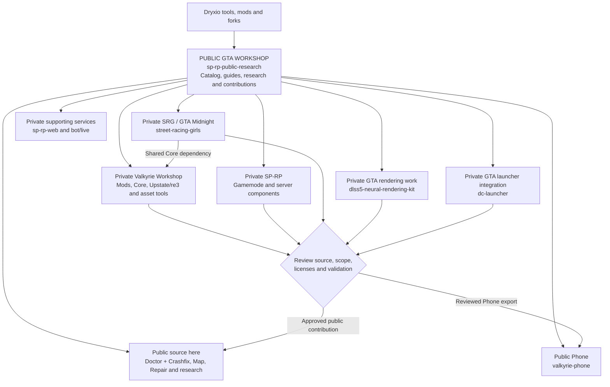

# The public GTA workshop

Start GTA work in `darkcenturies/sp-rp-public-research`: find the project,
read its public references, choose visibility and follow the source owner.
This is the main catalog and contribution entry point for our GTA III,
Vice City and San Andreas work, including multiplayer and server development.
The repository URL remains unchanged. A catalog entry is public documentation,
not approval to publish the implementation it describes.

## Project map

Solid arrows route work; the return arrow represents a deliberate publication
review, not automatic mirroring. Each implementation has one source owner.

## What is already public, and where

Visibility was checked through GitHub on **2026-10-01**. This describes source
visibility at that date, not current release quality or live deployment status.
Private links require access; public readers can still use the descriptions.

| Project / work | Source owner | Current visibility and publication boundary |
| --- | --- | --- |
| Doctor + Crashfix, Map, Repair | This repository; [mod catalog](MODS.md) | Already public source. Doctor/Crashfix share one artwork-free ASI. Map retains the earlier approved baseline. |
| Generated decompilation, protocol findings and existing analysis tools | This repository; [research](../research/README.md) | Already public, with target hashes, archive checksums and separate upstream notices. Historical partner targets remain evidence. |
| Phone and its reviewed trainer/map dependencies | [valkyrie-phone](https://github.com/darkcenturies/valkyrie-phone) | Already public source in its own buildable repository. Its reviewed shared code does not make all Workshop implementation public. |
| Shared Core, Atmosphere, Fuel, experimental Radar and standalone mod development | [valkyrie-workshop](https://github.com/darkcenturies/valkyrie-workshop) | Private owner. Unreleased/private implementation has not been approved for export here; individual source releases require scope, license and package review. |
| SRG / GTA Midnight | [street-racing-girls](https://github.com/darkcenturies/street-racing-girls) | Private San Andreas conversion; its owner instructions explicitly require private source. Shared Valkyrie Core comes from Workshop. The legacy SRG identifiers remain in use. |
| Upstate/re3 port and GTA III animation conversion tools | Valkyrie Workshop | Our compatibility patch and tooling are private. The separately public [novawish/re3](https://github.com/novawish/re3) upstream is not our owned project or the complete port. Upstream availability does not publish our patch. |
| GTA rendering / DLSS integration | [dlss5-neural-rendering-kit](https://github.com/darkcenturies/dlss5-neural-rendering-kit) | Private integration repository; component redistribution terms and reproducible configuration need review before any export. Historical local test profiles are not a universal compatibility claim. Only its GTA use belongs in this catalog. |
| GTA/SP-RP Launcher integration | [dc-launcher](https://github.com/darkcenturies/dc-launcher) | Private source. A build or release record is separate from anonymous source/download availability. Its WoW work is outside this workshop's scope. |
| SP-RP gamemode, accounts and server operations | [sp-rp](https://github.com/darkcenturies/sp-rp) | Private server implementation by owner policy. Generic reusable examples can be proposed separately. Player records, credentials and production secrets are never public workshop inputs. |
| AI, async persistence and multiplayer native components | Valkyrie Workshop | Private native component source consumed by the server; the catalog does not authorize copying it. Publish only separately reviewed generic interfaces or examples. |
| Website/UCP and Discord integration | [sp-rp-web](https://github.com/darkcenturies/sp-rp-web), [sp-rp bot/live](https://github.com/darkcenturies/sp-rp/tree/bot/live) | Private supporting source; their public-facing services do not expose their repositories. Server and bot use separate production branches. |
| Models, vehicle imports, maps, road nodes, animation and asset conversion | Workshop; project-specific work in SRG | Private authoring source and locally supplied assets. Sanitized techniques, original/synthetic examples and permitted tooling are publication candidates; copied game payloads are not implicitly approved. |

Third-party inputs keep their own attribution and distribution terms. Our
catalog does not redistribute their games, engines, textures or binaries.
RubyGame, WWE, Metalart and non-GTA Launcher/rendering features are outside scope.

## What we want to publish next

These are **proposals**, not already public source or approved releases:

- Practical mod-making guides, with the relevant Dryxio and original upstream references.
- Original/synthetic CLEO, native ASI and asset-authoring examples with reproducible checks.
- Generic server workshops: protocol evidence, component interfaces, test fixtures and reusable tooling after review.
- Public-safe project summaries, compatibility evidence and contribution tasks for SRG, Upstate and rendering work.
- Individual private mod/tool releases once their source, dependency notices, packaging and tests have been reviewed.

Every proposed item records the source owner, intended public output, current
visibility, why it is withheld, applicable terms and the remaining review.
Do not label a goal as shipped, or a source review as a runtime test. Private
because of owner policy, private pending release review and restricted inputs
are different reasons; state the applicable reason explicitly.

## The go-to path for new work

1. Start with this map, the [Dryxio catalog](../research/dryxio-catalog.md),
   [research workflow](RESEARCH_WORKFLOW.md) and the relevant component guide.
2. Decide visibility **before** writing code, issues, logs or attachments.
   A branch, issue or draft PR in a public repository is public. Keep sensitive
   requests and implementation in their private owner from the outset.
3. Public fixes to the approved mods/research are implemented here. Existing
   public Phone source is implemented in Phone, reconciling shared changes with
   Workshop through its reviewed sync process. New generic public components
   need a deliberate scope/allowlist review before inclusion.
4. Private implementation goes directly to its owner's canonical checkout or
   owned worktree. Use a public-safe catalog description here where appropriate.
   No private staging branch or automatic public-to-private dispersal is used.
5. Consult the task-relevant Dryxio references and original upstreams, recording
   revision, target, applicability and actual evaluation status. Follow their
   documented methods where applicable; explain a relevant tool's limitations
   or non-applicability instead of claiming it validated another platform.
6. Build/test in the owner. A public contribution requires reviewed source,
   license/provenance, public boundary checks and its applicable validation.
   Never merge private history into this public remote. Update the catalog when
   source visibility or approval changes.

7. Return findings to this repository for **every task started through it**,
   including work implemented elsewhere and useful negative results. Commit and
   push the public-safe record and open a PR in the same session. Keep restricted
   evidence in the private owner and return a sanitized outcome, validation,
   remaining questions and withholding reason here. Follow the detailed
   [agent return requirements](../AGENTS.md#mandatory-return-of-findings).

Source merges, binary releases, website downloads and live deployments remain
separate actions. [PUBLICATION.md](../PUBLICATION.md) defines the code boundary;
this broader catalog does not weaken it.
