# GTA Workshop: reference library atlas

Use [the README](../README.md) for the overview and
[documentation index](README.md) for guides. These maps explain how any reader
can find references, investigate a question and contribute reusable GTA knowledge.

| View | Question |
| --- | --- |
| [Library navigation](#1-library-navigation) | What can I find here and how do I contribute? |
| [Task flow](#2-research-and-mod-making-flow) | How do I turn a question into tested knowledge? |
| [Evidence requirements](#3-evidence-and-prerequisites) | What inputs and checks does each method need? |
| [Dryxio routes](#4-dryxio-reference-routes) | Which upstream references fit my task? |
| [Publication](#5-public-knowledge-boundary) | What can be shared, proposed or withheld and why? |

Blue means library/evidence; teal external references; amber decisions; green
public contributions; purple implementation outside the library; coral excluded
inputs or failed checks. Labels carry the meaning as well as colors.

## 1. Library navigation

Choose a task family, read upstream references and methods, inspect relevant
evidence, work in your project and return useful findings.
[Ten Valkyrie method families](VALKYRIE-TOOLING.md) complement upstream
references with public source, reusable techniques and validation questions. The library contains
no private product roster or local repository directory.

## 2. Research and mod-making flow

Define the question and exact target, select references, collect evidence,
implement elsewhere where needed and record actual validation. Failed or
unsuitable approaches return knowledge too. Select applicable published tools
using [the ten-family workflow table](GTA-SA-MOD-WORKFLOW.md#select-and-run-public-tools),
then inspect an exact entry ID, prerequisites and inputs before running.
Record actual use and outputs; [synthetic examples](workshop/EXAMPLES.md#run-public-tools-with-synthetic-inputs)
provide a starting point without game inputs.

## 3. Evidence and prerequisites

Arrows point from a method to the evidence or prerequisite it needs, not to a
product owner. Script, native, asset and protocol checks answer different questions.
The public-tool nodes connect all ten families to their execution prerequisites
and relevant evidence; dotted links mean applicability, not mandatory execution.

## 4. Dryxio reference routes

All 18 cataloged GTA repository references and the separate texture reference
are routed by task. Edges indicate research applicability, not adoption,
installation or permission to reuse. Preserve original fork-parent attribution.

Use [the task catalog](workshop/CATALOG.md),
[reference inventory](../research/dryxio-catalog.md) and
[recorded revisions](../research/dryxio-catalog.json). CLEO AI applies to scripts;
native/server verification needs its own methods and evidence.

## 5. Public knowledge boundary

Publish guides, references and approved research with reproducible observations
and explicit limitations. Keep mod implementation, mod releases, game payloads
and private data outside the library. Proposals stay labeled until completed.

[Coverage/backlog](workshop/PUBLICATION-BACKLOG.md) distinguishes existing
knowledge, proposals and exclusions. [PUBLICATION.md](../PUBLICATION.md) defines
the boundary. Historical target names remain attributed evidence, not current
affiliation or a private product directory.

See [worked examples](workshop/EXAMPLES.md),
[agent return rules](../AGENTS.md#mandatory-return-of-findings) and
[graph maintenance](workshop/README.md).
